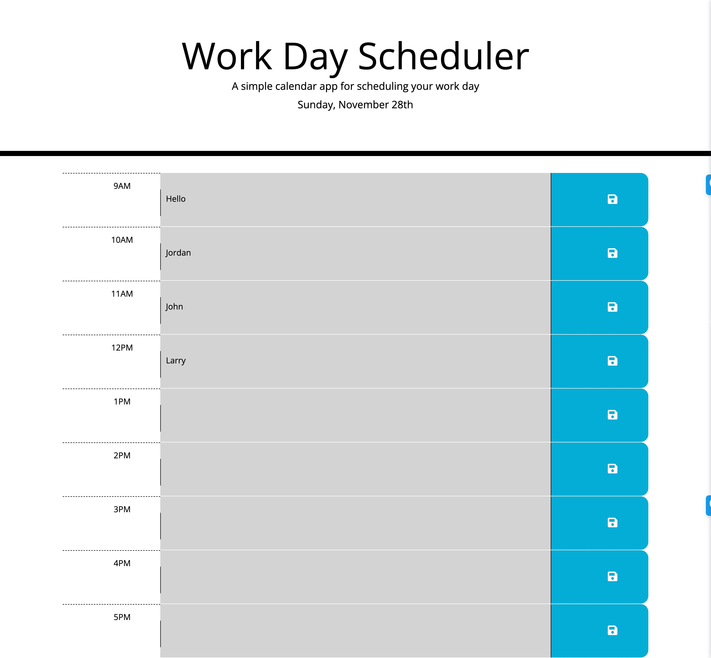

# Homework 5 - Third Party APIs Work Day Scheduler

## Description

I created a work day scheduler. At the top of the webpage, a user can see the current date.  When the user scrolls down, they can see timeblocks for each hour of the working day.  The timeblocks are color coded to indicate whether they are in the past, present, or future.  When the user clicks into a timeblock, they can enter text.  That text is saved when they clikc the save icon, and the text remains when they refresh the page.

## Screenshot

## Deployed Application

[Deployed Application](https://samrapow.github.io/homework5-third-party-APIs-work-day-scheduler/Develop/index.html)